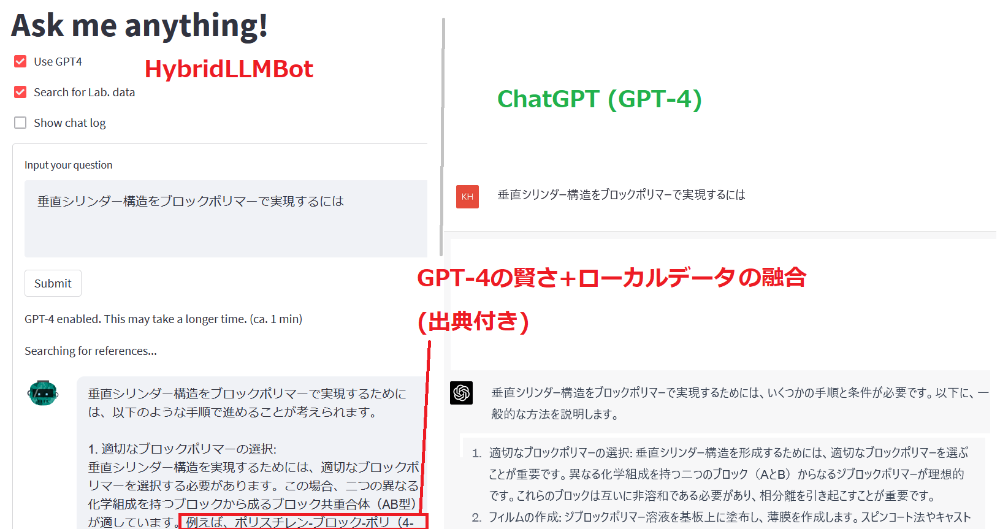

# Hybrid chatbot of GPT and local LLM
## 注意
- 開発中･未完成です
- 用いているローカルLLMは商用利用は不可なようなので､注意してください

## 仕組み
- ローカルLLM([Vicuna-7b](https://huggingface.co/AlekseyKorshuk/vicuna-7b))で手持ちのファイルのembed vectorを計算
- queryのembed vectorを同様に計算
- 類似度の高いreferenceを抽出し､GPTのqueryに載せて回答

- 


## モチベーション
- GPTのAPIでもembedding vectorは計算可能です
  - しかし､数十ページ程度の日本語の文章を読ませるだけで､数十円かかります
  - ラボ内の書類データ､数千件以上を検索したかったので､コスト的に､この方法は採用できませんでした
  - そこで､embedding vectorの計算はローカルLLMに行わせるというアプローチを取ることにしました

## Install
- conda_requirements.txtで環境構築
- settingsフォルダにkey.pyを作成
  - GPTのAPI_KEYを設定
    - API_KEY = "sk-XXXXXXX..."
- UseDataフォルダにoriginalフォルダを作成
  - その中に､回答に含めたいpdf or text dataを入れる

## 動作確認マシン
- Ununtu 18.04.5 LTS
- メモリ32 GB + スワッピング (言語モデルで30GB以上使います)
- Intel(R) Core(TM) i9-9900K CPU @ 3.60GHz
- GPU: 不使用

## 起動
- embedサーバー(起動に5分くらいかかります)
```
python embed_server.py
```
- フロントエンドサーバー
```
streamlit run bot_server.py --server.address 0.0.0.0
``` 
- index 更新
  - ipynbを参照

## 主なTODO
- 言語を跨いだ検索 (e.g., 日本語で検索→英語の文章を発掘)
    - DeepLで翻訳予定
- embedding vectorの計算､チャンク区切りetcの最適化
- バグ類の修正